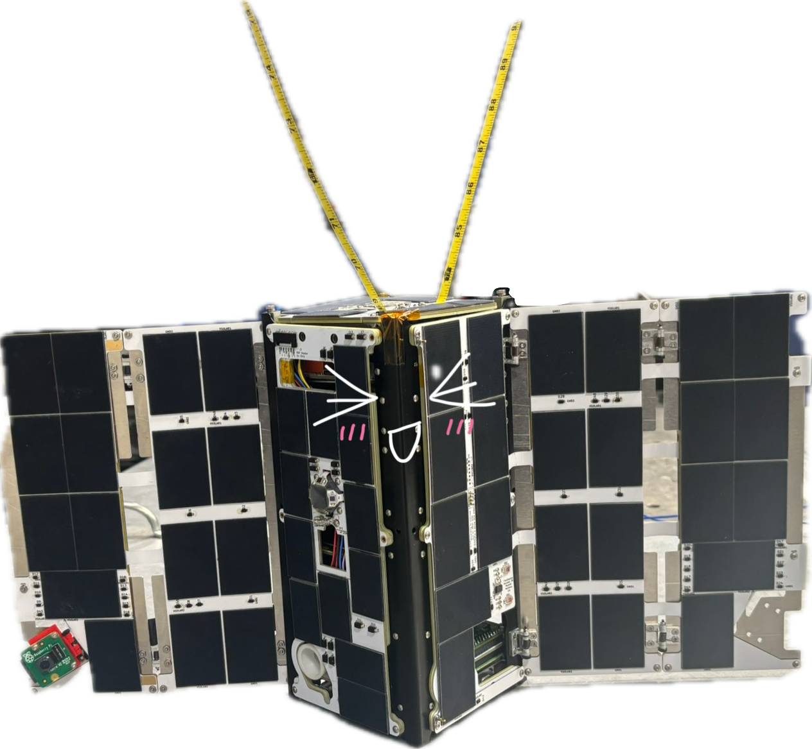
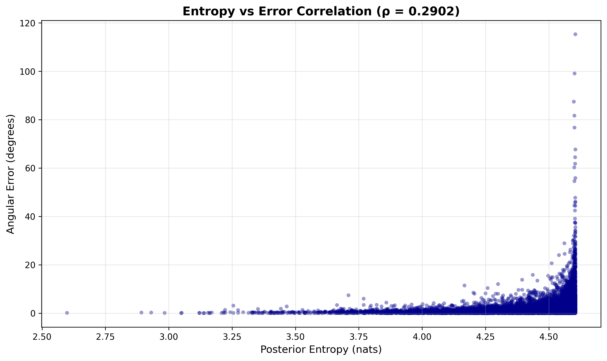
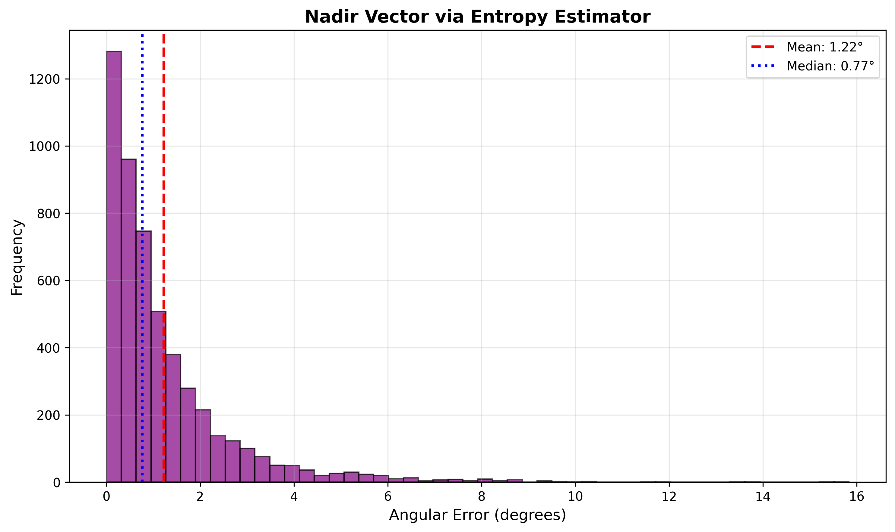
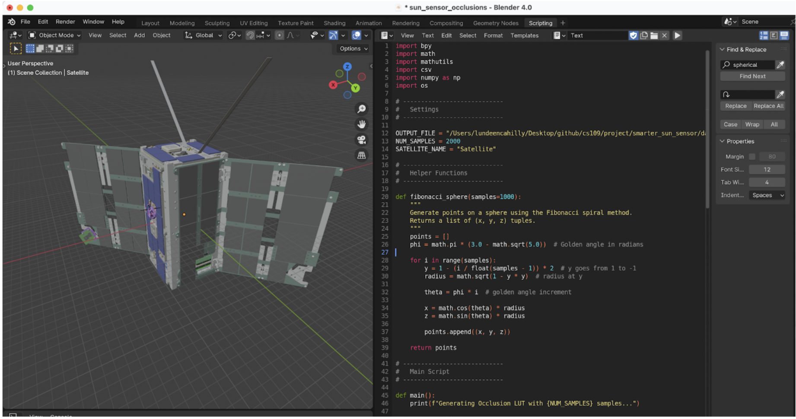

# Sunny Side Up!
## Coarse Sun Sensor-Only Attitude Determination for SmallSats

Small satellites have a very big problem.

Expensive, non-fault tolerant parts! You're limited in how many sensors you can carry, so any broken sensor becomes a massive problem.

A key satellite system that requires expensive and complex sensors is the Attitude Determination & Control System (ADCS). The ADCS figures out where the satellite is pointing and points it in a given direction for communications, measurements, etc.

Here's how the attitude determination problem works:

1. Compute "reference" vectors in an inertial frame. These are independent of your satellite's attitude, but depend on time and position!
2. You measure a vector in your satellite's frame of reference.
3. Compare the measurement to reference, you can figure out where you are pointing relative to an inertial frame - aka, attitude!

One super important note! You need at least 2 measurement vectors to constrain attitude. If you only have one vector, you could 'spin' around that axis and still get the same measurement. An additional vector constrains that 'spin'.

I'm building a satellite right now at the Stanford Student Space Initiative called SAMWISE (above!), which is launching in June! Our sensor suite consists of two magnetometers and 16 coarse sun sensors.

Our ADCS hardware is very cheap (<$3000), but that comes at a cost - we only have 2 measurement vectors. Coarse sun sensors are very reliable and distributed, as it's unlikely one fails, and if it does, we can simply ignore it. However, if our magnetometer experiences an issue, we will very likely lose that measurement vector entirely. This would mean we fully lose attitude. Uh oh.

But there's a solution! At first glance, coarse sun sensors are dumb. When light shines on them, an output voltage is produced which relates to the angle of incidence of the sun.

The insight is the following. Although the sun is by far the strongest signal for these sensors, Earth reflects light back up to our satellite! There are tons of complicating factors, but in theory, we can not only measure the sun vector, but also a nadir (earth) vector! We should be able to fully determine our attitude purely with sun sensors. Our problem now is to find the nadir vector that fits our sensor readings the best!

This is at its heart an inference and MLE problem! I want to find the nadir vector that is the most likely, and I can make a physical model to compute the probability that I get my sensor readings given a nadir vector candidate, so if **n** is the nadir vector, **s** is the sun vector, **y**ᵢ is the reading of sensor i, **ρ** is the albedo of the Earth at the sampled points, and **α** is the angle between the sun and nadir vector:

```
P(n|s,y,ρ,α) ∝ P(y|n,s,ρ,α) P(n|s,ρ,α)
```

The prior P(**n**|**s**,**ρ**,**α**) encodes a cool trick to save computation. Instead of searching a 2D surface of the unit sphere, I can instead, knowing (1) my sun vector and (2) the angle between my sun and nadir vectors using orbital mechanics and time, reduce this search space to a 1D disk! The prior terms end up being uniformly distributed, so:

```
P(n|s,y,ρ,α) ∝ P(y|n,s,ρ,α)
```

The likelihood P(**y**|**n**,**s**,**ρ**,**α**) requires a physics model that allows me to compute the expected sensor measurement from given sun and nadir vectors. The sun sensor would not change, so I would first pick a nadir candidate on the 1D disk search space.

Then, I projected sunlight onto my sensors. I accounted for specific satellite geometry using a lookup table to define V(vector), which returns 1 if the given unit vector is in view of sensor i:

```
y_sun,i = y_max × max(0, s · sensor_normal_i) × V_i(s)
```

Earth is an extended body, NOT a point source like the sun. I got creative and did the same process above but for 100 samples approximately uniformly sampled on the solid angle of the Earth in view of the satellite. I took the average of this Monte Carlo, ultimately estimating **y**_nadir,i. The math here is far more physics-based and complex, and Claude substantially helped the calculations for Lambertian reflection and the sampling strategy.

To build my likelihood, I used the insight that my sensor readings are the sum of these two intensities, plus some Gaussian noise:

```
y_pred,i = y_sun,i + y_nadir,i + noise
```

While I could have modeled this likelihood as gaussian, I followed a suggestion from Claude to use the Laplace distribution (L1), where:

```
P(y_i | n,s,ρ,α) = (1/2σ_i) × exp(-|y_i - y_pred,i|/σ_i)
```

I first chose this likelihood because empirically it drastically improved my prediction accuracy. I believe this is because while the sensor noise itself tends to be gaussian, effects like sensor saturation, sensor visibility blockage, etc. meant L2 penalized many valid edge cases too heavily.

```
L(n) = ∏_{i=1}^{16} P(y | n) = ∏_{i=1}^{16} (1/2σ_i) × exp(-|y_i - y_pred,i|/σ_i)
LL(n) = ∑_{i=1}^{16} |y_i - y_pred,i|/σ_i + constant
```

Normally we'd take the derivative here with respect to **n**, but my Monte Carlo sampling prevents me from doing things analytically. Instead, I devised a different argmax strategy where I began with 180 nadir vector candidates uniformly spaced on the full disc. I found the best fit for this first guess, and then tried 100 candidates on a ±15º arc around the previous best fit, and finally 100 candidates on a ±3º arc to give me a 0.06º precision.

We're not done - bad estimates have to be heavily penalized and filtered out, because if you feed bad estimates to the attitude filter (an extended Kalman filter) that will throw off our attitude estimate. To reject bad guesses, I calculated the entropy of the likelihoods of the final ±3º arc to reject samples where the uncertainty was relatively even (high entropy), because these tended to be cases with bad initial first guesses! I then set a threshold of entropy < 4.5 (see plot below).

I tested my algorithm on a simulated dataset of N=10000 samples for the SAMWISE cubesat design. The algorithm rejected 4856/10000 samples, and ultimately predicted nadir vectors with a 1.22º mean error, a standard deviation of 1.44°, and a max error of 15.83°.

 

I'm actually blown away at these results. It just seems so improbable that such cheap, simple sensors could make such an accurate guess for both signals when I factored in noise, non-point source nature of the Earth, among other complications. This is amazing as well because sun sensors can update incredibly fast, unlike other sensors like star trackers or fine sun sensors.

This result is significant on a broader scale right now because the cost barrier to launching payloads to space will decrease very meaningfully (~10x) with the maturing development of SpaceX's Starship. With that cost differential, payloads will be primarily constrained by the cost of the satellite bus, and industry is not factoring this in so the norm is still highly-precise, expensive sensors.

With more cheap, robust alternatives for ADCS stacks, there will be the opportunity for wonderful people to make cheaper, smarter, and more robust satellites that enable more research and industry activity that will lead to discoveries that help everyone at a large scale. Super stoked!

by Lundeen Cahilly :)

---

##  Addendum
### Acknowledgements

Big thanks to Claude for helping me rapidly prototype a ton of different ideas for this system. I spent a week on and off trying different approaches to the problem, including RANSAC, neural networks, and others before arriving at this final approach. I had a lot of ideas and not all of them worked out, and I don't think I could've tried them all and spent time on this solution if I hadn't had AI as a force multiplier.

### Attitude Estimation Plots

Although I previously wrote an extended Kalman filter for this satellite to estimate where we are pointing for this satellite, our current 6-DOF dual orbit / attitude simulator cannot accurately simulate sun sensor data. I was curious to see how accurate our attitude estimation could get if we purely used sun sensors, and to do so, I made a simple MLE attitude estimation benchmarker that, given two vector measurements, would make the optimal guess for attitude given the measurements. This is more or less equivalent to what our estimate would be if we ran the update step of the attitude filter once with these vectors and associated uncertainties.

When ran on the same dataset above, I got the following results:


The attitude accuracy is approximately 3º mean error, which is far better than I had ever expected. The sun vector estimation I had previously written in flight code and ported into Python, and naturally has reasonable error (and could be optimized!). What I find notable is that the mean error of the nadir vector only shifts very slightly ~1º because we're sometimes feeding in inaccurate sun vector priors. A future development on my nadir vector estimation algorithm would be to treat this prior as a random variable itself, and make changes to both the prior and search space logic.

### Dataset via Simulation

To accurately assess which sensors could see what light, I ran a raytracing script in Blender on the CAD model of our satellite.



This script allowed me to create a lookup table of which sensors could see a given light ray, which I then used while simulating the dataset and in my nadir vector estimator.

I believe my main inaccurate assumption in my nadir estimation model is that we know the albedo of every point on Earth below us. While a lookup table is usually sufficient, clouds and other weather conditions degrade this assumption. I'm still optimistic about the accuracy of this algorithm, but I believe that would be the primary limitation.

Ultimately we'll have this system in space in June 2026, so I could downlink a real dataset of these sensor readings and assess the algorithm. So excited!
